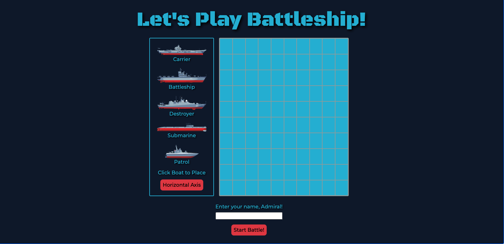
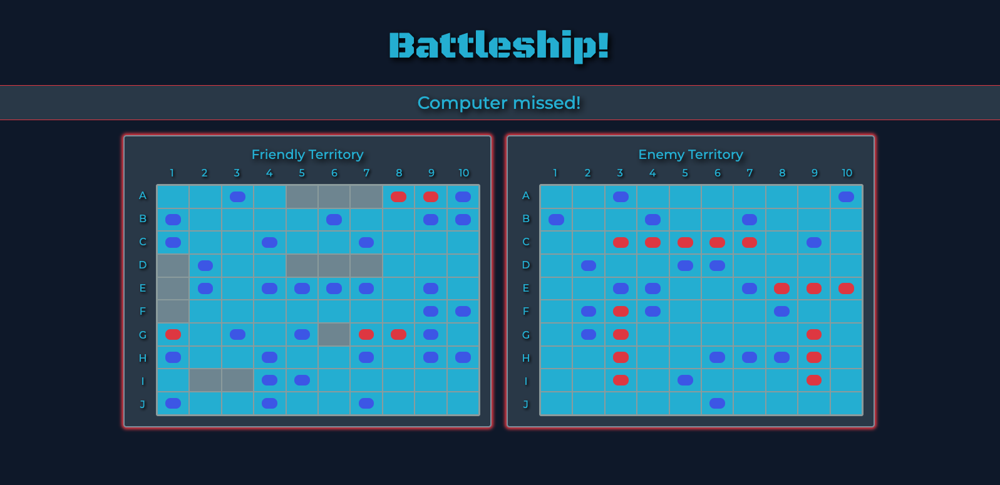
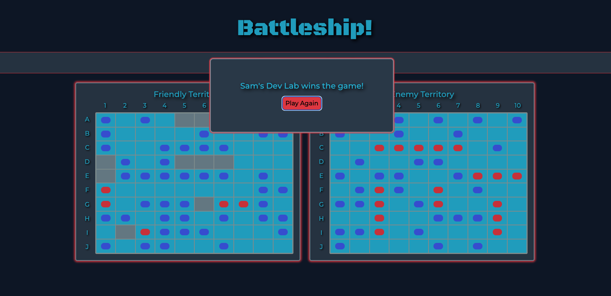

# 🚢 Battleship

Battleship game developed for [The Odin Project](https://www.theodinproject.com/) curriculum. Sink the computer's fleet and secure your status on the high seas!

## 💻 Technologies Used:

- Vanilla JavaScript
- HTML
- CSS
- Jest (for testing core logic)
- Webpack

## ❇️ Features:

- Click and point boat placement
- Axis button - alters boats orientation
- Input field to add name of admiral (player)
- Interactive gameboard - click the cell that you wish to target
- Win screen with play again - allows player to restart the game

## To Run:

1. Clone and Install

```
git clone https://github.com/SamsDevLab/battleship.git
cd battleship
npm install
```

2. Run locally (dev server):

```
npm run dev
```

3. Build for production:

```
npm run build
```

## 📺 Screenshots:





## Image Credit:

- Boat SVGs extracted from macrovector's "Military boats collection" on [Freepik](https://www.freepik.com/free-vector/military-boats-collection_9585890.htm#fromView=keyword&page=1&position=0&uuid=3835a9a5-9943-4e27-8a02-cfec2bf563c6&query=Military+ship)
